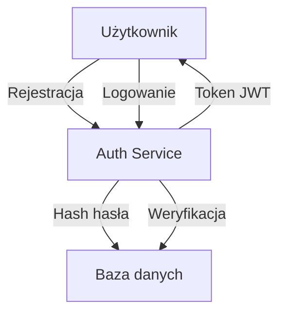
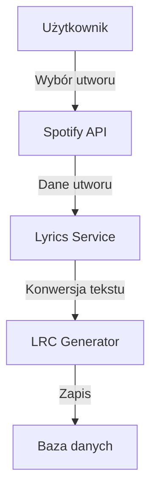
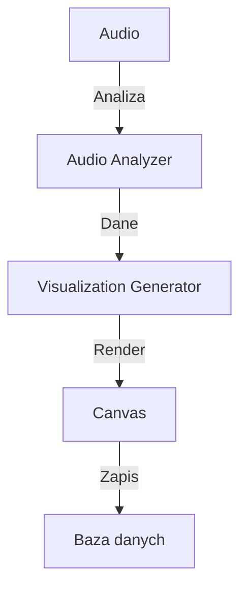

# Przepływ danych

## Wersja dokumentu: 0.2.0

## Przepływy danych w systemie

### 1. Autentykacja i autoryzacja


### 2. Import utworów


### 3. Generowanie wizualizacji


## Modele danych

### User
```typescript
interface User {
  id: string;
  email: string;
  password: string;
  username: string;
  createdAt: Date;
  updatedAt: Date;
}
```

### Song
```typescript
interface Song {
  id: string;
  title: string;
  artist: string;
  spotifyId: string;
  lyrics: string;
  lrc: string;
  userId: string;
  createdAt: Date;
  updatedAt: Date;
}
```

### Visualization
```typescript
interface Visualization {
  id: string;
  songId: string;
  type: string;
  data: string;
  createdAt: Date;
  updatedAt: Date;
}
```

## Relacje w bazie danych

### One-to-Many
- User -> Songs
- User -> Visualizations
- Song -> Visualizations

### Many-to-Many
- Songs <-> Tags
- Users <-> Playlists

## Cache
- Redis dla tokenów
- Cache dla wyników wizualizacji
- Cache dla wyników wyszukiwania 